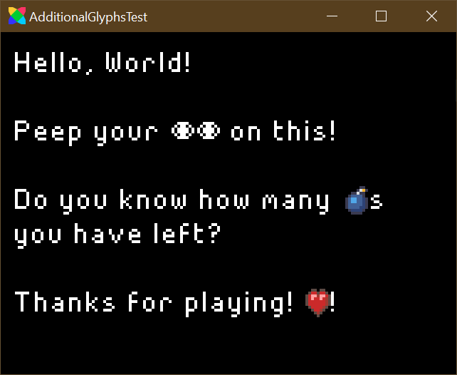

# HFAdditionalGlyphsDemo
This is a demonstration of the Additional Glyphs feature for `FlxBitmapFont`

## Usage

```haxe
var font = new FlxBitmapFont("assets/font.png", 8, 8, FlxBitmapFont.TEXT_SET1);
font.appendGlyphs(FlxAtlasFrames.fromSparrow("assets/images/glyphs.png", "assets/images/glyphs.xml"));
```

Then, when you want to display a Glyph in your `FlxBitmapText` just put `{{glyphname}}` in your `text` string.


